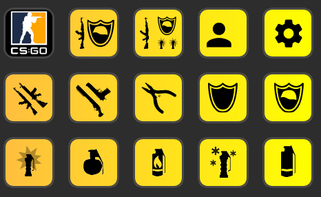

# Ultimate CS:GO Buys
 Counter Strike: Global Offensive buy menu hotkeys for the Elgato Stream Deck.

## How To Get Started
1. Buy a Stream Deck.
2. Download the [CS_GO.streamDeckProfile](CS_GO.streamDeckProfile) file.
3. Import it
4. On CS:GO, add the bind keys by going to the Developer terminal and while in the window use the cog icon on the stream deck to paste all the commands. 
    - **WARNING This can potentially overwrite your CS:GO binds, so check the binds first** - You can do this through the stream deck application.
4. Feel free to change the binds around, but make sure you change the bind 

## Notes
- This uses up a lot of in-game keys for binds. I could not find a way around this so if you know how let me know. For example, CS:GO binds do not support F13+ keys. 

## Questions?
- Feel free to [contact me](mailto:contact@kaviichi.com) or contribute to the project. 
